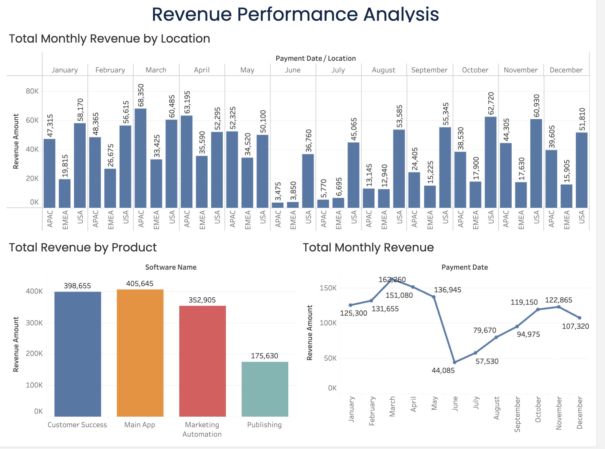
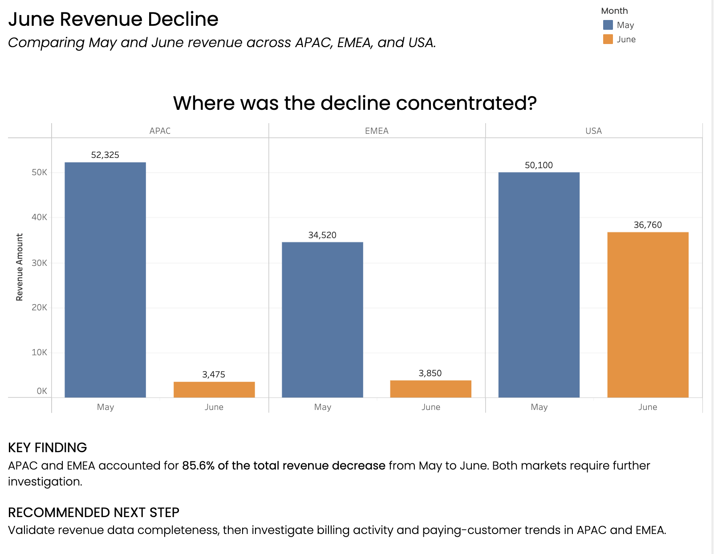
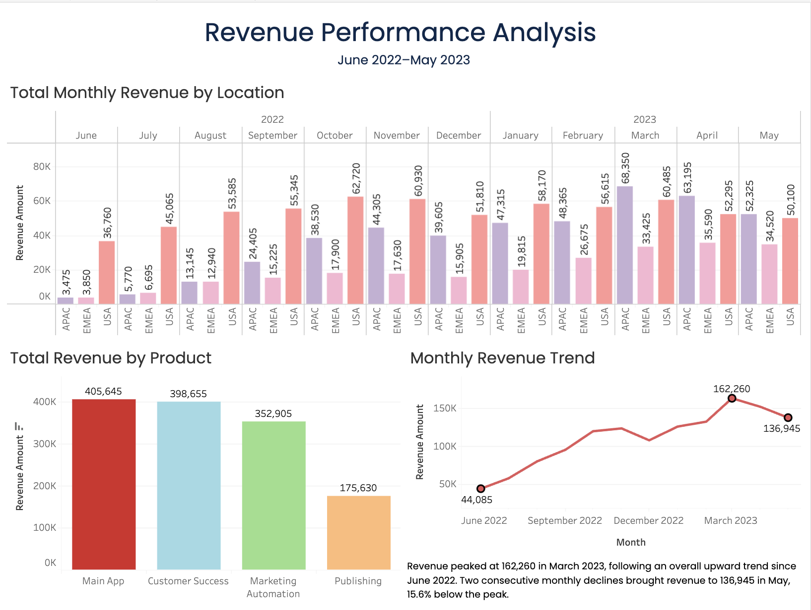

# Development & Data Validation

## The Check That Changed the Story

The first dashboard appeared to show a sharp revenue decline from May to June. Before building recommendations around it, I checked whether the dates represented consecutive reporting periods.

That check changed the interpretation of the entire chart.

## 1. Problem: Month Names Hid the Year

The original chart displayed January through December using month names only.

The view placed January–May 2023 before June–December 2022. This made May and June appear consecutive, although they belonged to different years.

The initial interpretation described a May-to-June revenue decline. That conclusion was incorrect.

*Before: calendar month order did not preserve the reporting timeline.*

## 2. Investigation: Adding the Year

I added `YEAR(Payment Date)` to the view and checked the years associated with the compared months.

The result showed:

- June belonged to **2022**.
- May belonged to **2023**.
- The comparison was therefore not a month-over-month change.

I withdrew the earlier June decline interpretation and the regional contribution figures associated with it.

*Validation: displaying the year exposed the misleading comparison.*

## 3. Solution: Rebuilding the Timeline

I rebuilt the monthly trend using a continuous month-and-year date axis.

For the regional chart, I displayed year, month, and location together so that the reporting sequence remained visible.

The corrected period runs from **June 2022 to May 2023**.

This corrected the visualization and its interpretation; it did not change the underlying revenue values.

*After: both time-based charts preserve the correct chronology.*

## 4. Result: A Different Investigation Priority

The corrected timeline shows an overall upward trend from June 2022 to a peak of **162,260 in March 2023**, with a temporary decline in December.

Revenue then declined in two consecutive months:

| Month | Revenue | Change from previous month |
|---|---:|---:|
| March 2023 | 162,260 | — |
| April 2023 | 151,080 | −6.9% |
| May 2023 | 136,945 | −9.4% |

May revenue was **15.6% below the March peak**.

The business question changed from “Why did revenue fall in June?” to “What contributed to the declines in April and May 2023?”

The regional comparison identifies decreases in APAC and USA between March and May, while EMEA increased slightly. Explaining these changes requires additional product, customer, billing, and acquisition data.

## 5. Improving Readability

### Product Ranking

I sorted products by revenue instead of alphabetical order.

This makes the largest contributors easier to identify: Main App and Customer Success together account for **60.3%** of revenue across the displayed period.

The ranking describes revenue contribution, not profitability or marketing efficiency.

### Selective Trend Labels

The initial line chart had closely spaced value labels.

I retained labels for the first month, the peak, and the final month. Other monthly values remain available through tooltips.

This highlights the main stages of the trend while reducing visual clutter.

### Reporting Context

I added the reporting period to the dashboard title area and simplified technical field labels.

Readers can now identify the time range and understand the charts with less reliance on the underlying Tableau field names.

## 6. What This Improved

| Improvement | Benefit |
|---|---|
| Preserving month and year | Prevented an invalid month-over-month interpretation |
| Withdrawing incorrect findings | Kept recommendations consistent with the evidence |
| Sorting products by revenue | Made the contribution ranking easier to read |
| Reducing trend labels | Highlighted the beginning, peak, and latest value |
| Showing the reporting period | Made the scope of the dashboard explicit |

## 7. Remaining Validation

The date check resolved the chronology issue, but it does not establish that the source data is complete.

Before making operational decisions, further checks should confirm:

- Complete and comparable monthly coverage.
- Currency and revenue definitions.
- Transaction grain and duplicate records.
- Treatment of refunds and other adjustments.
- Reconciliation to source payment records.

## Key Takeaway

A plausible chart can still support an incorrect conclusion when its date context is missing.

Checking the year changed both the revenue story and the recommended investigation. The final dashboard provides a clearer starting point for analysis, while keeping observed changes separate from unverified explanations.
