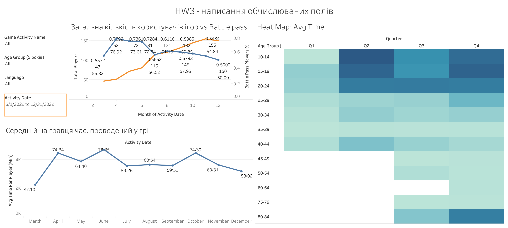

# Project Development

## From Coursework to an Analytical Case Study

The original assignment required three worksheets: monthly players and Battle Pass participation, average playtime per player, and an age-by-quarter playtime heatmap.

The portfolio version connects these views through a business question:

**Does a larger player audience also mean broader Battle Pass participation and higher average playtime?**

The dashboard presents these measures together while keeping their definitions and limitations explicit.

## Original Dashboard

The original view is preserved to document the starting point. The sections below explain how chart layout, metric presentation and filter selection were refined.

## 1. Separating Counts from Percentages

### Challenge

Player counts and Battle Pass participation describe different dimensions of engagement. Overlapping lines, scales and labels made the original view difficult to read.

### Change

The measures were placed in two vertically aligned panels with a shared monthly timeline:

- Monthly player count.
- Battle Pass participation rate, formatted as a percentage.

### Result

The revised view makes it easier to compare audience size with participation without confusing their units.

April had 40 Battle Pass participants among 52 players. December had 75 participants among 150 players. The participant count increased while the participation rate fell from 76.9% to 50.0%.

## 2. Making Playtime Labels Meaningful

### Challenge

Average playtime needed to be expressed as a duration rather than a decimal value alone. An additional player-count panel also created unnecessary repetition.

### Change

The worksheet was simplified to one monthly playtime line. The vertical axis shows hours, while labels display average duration in HH:MM format.

The calculation divides total recorded seconds by distinct players. Fractional minutes are truncated, and minutes always use two digits.

### Result

A value such as 78:35 can be read directly as 78 hours and 35 minutes per player over the month.

The labels support interpretation while the numeric hours remain available for plotting.

## 3. Building a Readable Age-by-Quarter Heatmap

### Challenge

The initial layout did not present quarters as clearly separated columns, and small marks made comparisons difficult.

### Change

Year and quarter were used as discrete column headers. Five-year age groups form the rows, with square marks sized to fill the cells.

Color represents average playtime in hours. Labels show HH:MM, and tooltips include distinct-player counts.

### Result

The heatmap supports comparisons across age groups and reporting quarters. Player counts provide context for averages that may be based on small groups.

Q1 is explicitly identified as containing March only.

## 4. Clarifying Game Selection

### Challenge

The activity-name field combines the game name with the activity type. Filtering directly on this field could select individual activities rather than whole games.

### Change

A separate Game field was extracted from the text before the colon. The dashboard uses this field for game selection.

Activity date, age group, game and device language filters were configured to apply to all three worksheets.

### Result

Users can select a game while keeping its recorded activity types in scope. The worksheets use a consistent filter context.

## 5. Keeping Visual Formatting Practical

### Challenge

Heatmap label alignment controls did not behave as expected in the available Tableau interface. Long decimal values in the color legend also reduced readability.

### Change

The heatmap retained a readable label placement, and the color legend was formatted to one decimal place.

### Result

The legend is easier to scan, and duration labels remain readable within the cells.

## Final Dashboard

[Explore the interactive dashboard →](https://public.tableau.com/app/profile/nataliia.fofanova/viz/3_PlayerEngagementBattlePassParticipation/PlayerEngagementBattlePassParticipation)

## Analytical Takeaway

Audience size, feature participation and average playtime can move in different directions.

The revised dashboard helps product and game operations teams identify questions for further investigation. It does not establish the causes of engagement changes, purchases or retention.
