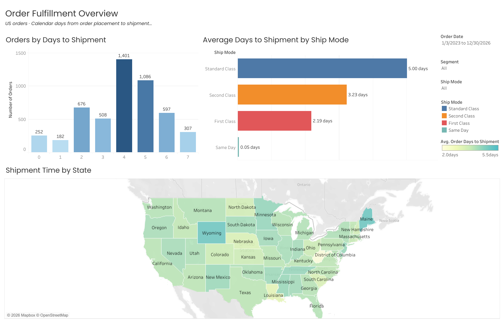

# Superstore Order Fulfillment Analysis

Understanding how time to shipment varies by shipping mode and geography.

**Course:** GoIT Data Analytics
**Module:** Tableau
**Project type:** Additional coursework expanded into a portfolio case study

## Business Question

How long does it take to ship an order, and how does that interval vary across shipping modes and US states?

## Project Overview

This case study explores the interval between order placement and shipment using the Tableau Sample Superstore dataset.

Three views will show:

- Average days to shipment by shipping mode.
- Distinct order counts by days to shipment.
- Average days to shipment across US states.

The dashboard will include order date, customer segment and shipping mode filters.

## Interactive Dashboard

[Explore the dashboard on Tableau Public →](https://public.tableau.com/views/4_SuperstoreOrderFulfillmentAnalysis/OrderFulfillmentOverview)

Use the order date, customer segment and shipping mode filters to explore all three views.

The dashboard measures calendar days from order placement to shipment. It does not measure delivery time to the customer.

## Dashboard Overview

Full-period view of US orders, with all customer segments and shipping modes selected.

## Key Findings

Full-period results for US orders, with all segments and shipping modes selected.

- The analysis includes **5,009 distinct orders**.
- Average time from order placement to shipment is **4.0 calendar days**.
- **Standard Class** averages **5.0 days**, compared with **3.2 days** for Second Class and **2.2 days** for First Class.
- **Four days** is the most common shipment interval, covering **1,401 orders**.
- **49.7% of orders** shipped four or five calendar days after placement.

Same Day averages less than 0.1 days and rounds to 0.0 at one decimal place. This does not mean every order in that category shipped on its placement date.

## The Story Behind the Dashboard

### Start with the distribution

The average is approximately four days, but the distribution shows how individual orders differ. Almost half shipped after four or five days, while other orders ranged from same-date shipment to seven days.

### Add shipping-mode context

Standard Class represents 2,994 of the 5,009 orders and has the longest average interval.

Its large share helps explain the overall pattern. Comparing shipping modes provides context before interpreting longer intervals as operational problems.

### Use geography to ask a more precise question

The state map highlights differences in average time to shipment.

Those differences should be investigated within comparable shipping modes and with order counts visible. A darker state is a starting point for analysis, not evidence of a service failure.

The dashboard helps operations teams decide where to investigate. Promised shipment dates and customer delivery records are needed to assess lateness and delivery performance.

## Business Applications

Operations teams can use the dashboard to identify differences in order processing and prioritize further investigation.

Customer experience teams can use the findings to review expectations around dispatch timing.

Comparisons describe observed patterns. They do not establish the causes of delays or whether service commitments were met.

## Data and Scope

Source: Tableau Sample Superstore, supplied with the assignment.

[Download the source Excel file →](data/superstore.xls)

The workbook contains Orders, People and Returns worksheets. This analysis uses Orders and filters Country/Region to United States.

The original file is preserved unchanged, including Canadian records. The US restriction is applied in Tableau.

Each row represents an order line. Orders can contain multiple product lines, so order counts use distinct Order IDs and average days to shipment gives each order equal weight.

## Metric Definition

**Days to shipment:** the calendar-day difference between Order Date and Ship Date.

Ship Date records shipment, not confirmed customer delivery. The dataset therefore supports analysis of time to shipment, not transit time or end-to-end delivery time.

## Planned Deliverables

- Interactive Tableau Public dashboard.
- Dashboard screenshot.
- Metric definitions and validation notes.
- Findings and business recommendations.
- Documentation of development decisions.

## Methodology

[Metric definitions and limitations →](docs/methodology.md)

How shipment intervals and distinct order counts are calculated, why order-level aggregation matters, and what the dashboard can explain.

## Tools and Skills

Tableau · Calculated fields · Order-level aggregation · Geographic analysis · Visual storytelling

## Project Status

Source file reviewed. Dashboard development and order-level metric validation are next.
