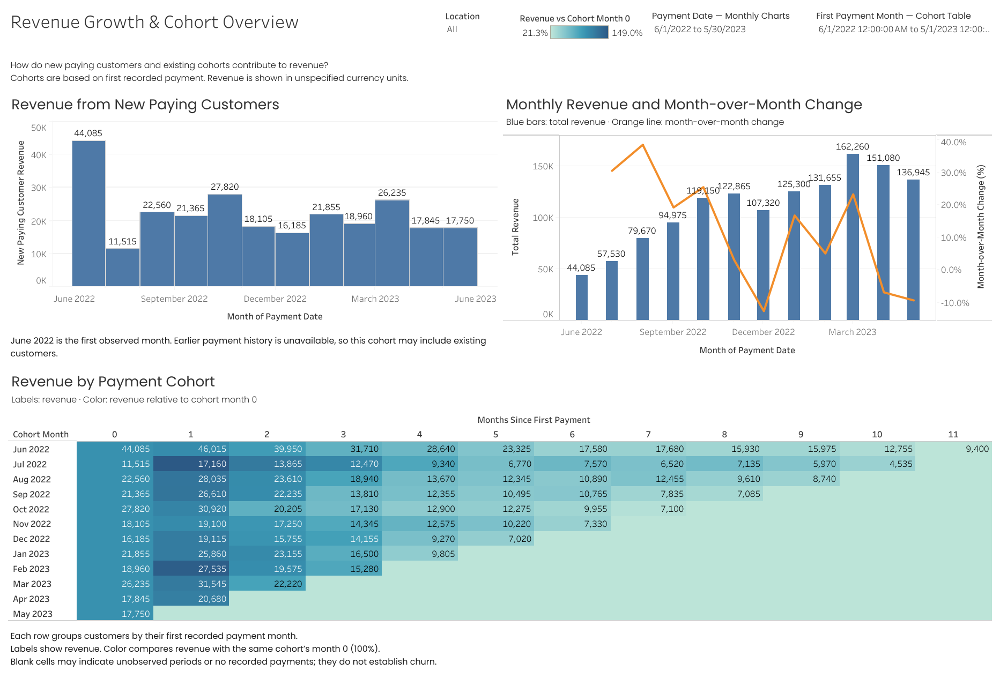

# Revenue Growth & Cohort Analysis

Exploring revenue growth through new paying customers and payment cohorts.

**Course:** GoIT Data Analytics
**Module:** Tableau — LOD Expressions and Table Calculations
**Project type:** Coursework expanded into a portfolio case study

## Business Question

How does revenue change over time, how much comes from newly paying customers, and how does each payment cohort develop after its first payment?

## Project Overview

This project extends the earlier revenue analysis with three views:

- Revenue from new paying customers in their first payment month.
- Monthly total revenue and month-over-month percentage change.
- Cohort revenue by months since the first recorded payment.

The dashboard includes a Location filter for all three views, a Payment Date filter for the monthly charts, and a First Payment Month filter for the cohort table.

## Data and Scope

[View the source CSV →](data/saas_revenue.csv)

The supplied dataset contains 123,195 rows with customer identifiers, payment dates, locations, products, enterprise-customer flags and revenue amounts.

Cohorts are defined at customer level using `user_id`, across all products. First payment means the earliest positive payment recorded in the supplied dataset.

Calculation logic, selected reference checks, filter behavior and interpretation limits are documented in the methodology.

## Interactive Dashboard

[Explore the dashboard on Tableau Public →](https://public.tableau.com/app/profile/nataliia.fofanova/viz/5_RevenueGrowthCohortAnalysis/RevenueGrowthCohortOverview)

Use Location to filter all three views.

Payment Date controls the monthly charts. First Payment Month selects cohorts while preserving their observed revenue history and month-zero baseline.

## Dashboard Overview

Full-period view for June 2022–May 2023, with all locations and cohorts selected.

Payment Date filters the monthly charts. First Payment Month selects cohort rows while preserving their month-zero baseline.

## Metric Naming

The assignment calls first-payment-month revenue “New MRR.”

This case uses **New Paying Customer Revenue** because the available payment data does not by itself establish recurring subscriptions or monthly normalization.

A customer's first recorded payment may not be their first-ever payment if earlier history is unavailable.

## Cohort Analysis

Customers are grouped by their first recorded payment month.

Each cell shows the cohort's revenue at a given number of months after that first month. Color represents revenue relative to the same cohort's month-zero revenue.

This ratio describes cohort revenue development. It is not customer retention or subscription net revenue retention.

## Business Applications

Product and finance teams can use the dashboard to distinguish revenue from newly paying customers from subsequent cohort revenue.

Marketing teams can investigate acquisition cohorts further when campaign attribution and acquisition costs become available.

## Analytical Priorities

- Preserve consecutive year-month chronology.
- Define customer identity and first-payment scope.
- Document how filters affect LOD expressions.
- Calculate monthly changes using the preceding calendar month.
- Keep cohort month-zero comparisons consistent.
- Distinguish incomplete observation periods from zero revenue.

## Key Findings and Business Implications

### Revenue rose from the first observed month to the March 2023 peak

Recorded monthly revenue rose from 44,085 in June 2022 to 162,260 in March 2023 — approximately 3.68 times the initial value.

This comparison describes revenue growth but does not establish its cause. The dashboard separates first-payment-month revenue and cohort contributions to support further investigation.

### Existing cohorts can generate more revenue than in their initial month

The June 2022 cohort generated 46,015 in month 1, compared with 44,085 in month 0 — approximately 104.4% of its initial-month revenue.

This does not establish improved customer retention. Differences may reflect payment timing, purchase frequency or payment amounts; these explanations require further analysis.

### Cohorts require comparable observation windows

Recent cohorts have fewer observed months. Compare revenue at the same cohort age, such as month 1 or month 2, rather than comparing lifetime totals.

The June 2022 cohort may include customers who paid before the dataset began, so it cannot be treated as a confirmed acquisition cohort.

## Recommended Next Steps

- Quantify how much each month's revenue comes from first-payment-month customers versus previously observed paying customers.
- Add paying-customer counts and revenue per paying customer to distinguish changes in customer volume from changes in spending.
- Compare cohorts at the same age and investigate differences by location and product.
- Confirm currency, payment-record grain and subscription status before extending the analysis to MRR, churn or LTV.

## Methodology

[Metric definitions, cohort calculations and filter behavior →](docs/methodology.md)

[Tableau calculated fields and table calculation settings →](docs/tableau-calculations.md)

Documentation of first-payment LOD expressions, month-over-month table calculations, cohort revenue ratios and interpretation limits.

## Tools and Skills

Tableau · LOD Expressions · Table Calculations · Cohort Analysis · Revenue Analysis

## Project Status

Dashboard published. Source CSV, dashboard preview, findings, methodology and Tableau calculation reference included.

Selected reference values were checked. Further analysis is proposed in Recommended Next Steps.
