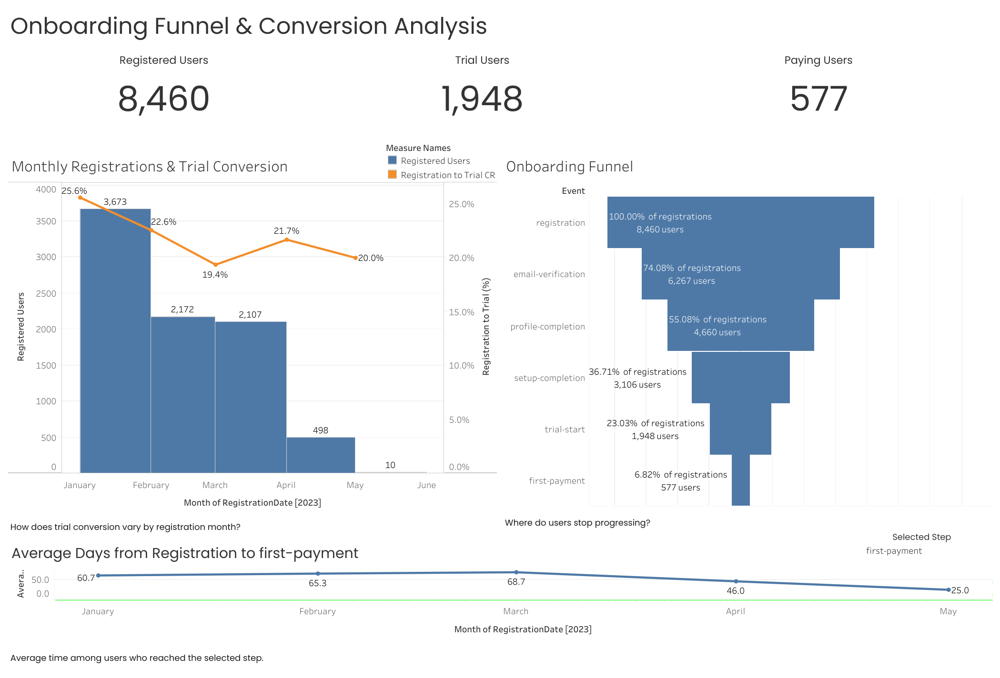
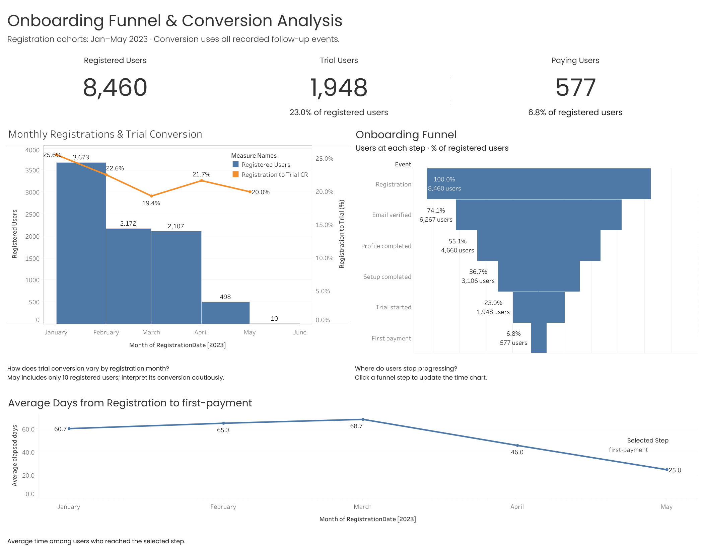
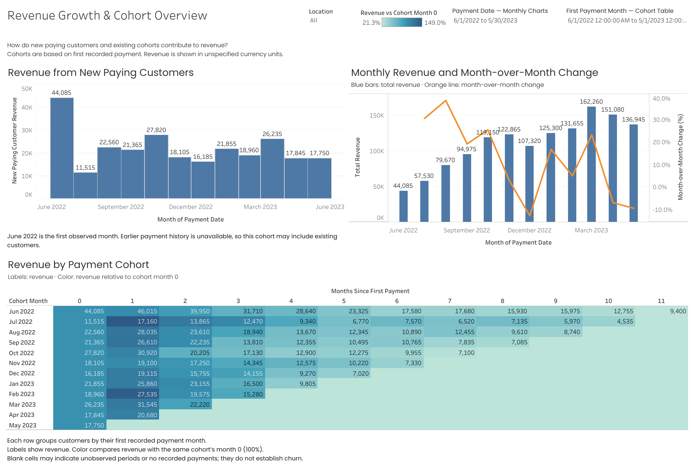
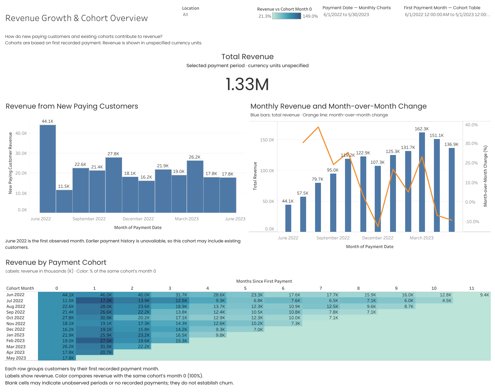

# Dashboard Design & Usability Review

Improving the visual hierarchy, metric clarity and readability of two Tableau dashboards.

**Course:** GoIT Data Analytics  
**Module:** Visual Design of Analytical Dashboards  
**Project type:** Coursework expanded into a portfolio design review

## Business Question

How can dashboard design help users find key revenue and onboarding information quickly while preserving analytical context?

## Project Overview

This project reviews and redesigns two existing portfolio dashboards:

- Onboarding Funnel & Conversion Analysis.
- Revenue Growth & Cohort Analysis.

The review focuses on four principles: a five-second overview, prominent key metrics, clear labels and units, and consistent use of color.

The five-second principle is a design goal. No timed user study has been conducted.

## Interactive Dashboards

| Dashboard | Main questions | Link |
|---|---|---|
| Onboarding Funnel & Conversion Overview | How many users registered, started a trial and paid? What share reached each step? How long did reaching a selected step take? | [Explore on Tableau Public](https://public.tableau.com/app/profile/nataliia.fofanova/viz/DashboardDesignUsabilityReview/OnboardingFunnelConversionOverview) |
| Revenue Growth & Cohort Overview | What is total revenue for the selected payment period? How does monthly revenue change? How much comes from newly paying customers? How does cohort revenue develop? | [Explore on Tableau Public](https://public.tableau.com/app/profile/nataliia.fofanova/viz/DashboardDesignUsabilityReviewRevenueGrowthCohortAnalysis/RevenueGrowthCohortOverview) |

## Design Changes

### Onboarding Funnel & Conversion Overview

- Displayed registered, trial and paying-user counts in the top row.
- Made registration-to-trial and registration-to-payment conversion visible directly on KPI cards.
- Shortened funnel step names and displayed user counts alongside conversion from registration.
- Clarified the registration-cohort period and follow-up scope.
- Added a warning about the small May cohort.
- Added instructions for selecting a funnel step to update the elapsed-time chart.
- Used blue for user counts and elapsed time, with orange for the monthly trial-conversion line.

### Revenue Growth & Cohort Overview

- Added a prominent Total Revenue KPI above the monthly charts.
- Rounded the total to millions and chart labels to thousands.
- Clarified that the dataset does not specify currency.
- Explained the blue revenue bars and orange month-over-month change line.
- Clarified that cohort labels show revenue and color shows revenue relative to the same cohort's month 0.
- Adjusted the layout to keep chart titles, axes and labels readable.
- Kept interpretation notes about first recorded payments and incomplete cohort observation periods visible.

## Before and After

### Onboarding Dashboard — Before

### Onboarding Dashboard — After

### Revenue and Cohort Dashboard — Before

### Revenue and Cohort Dashboard — After

## Review Outcome

The revised dashboards place headline metrics above detailed charts, use shorter numeric labels and explain the meaning of colors and calculations.

These changes are intended to support faster orientation and clearer interpretation. Their effect on task completion time or user understanding has not been measured.

## Data and Methodology

This review uses the educational datasets and analytical definitions documented in the original projects.

- [Onboarding data, metrics and limitations](../06-onboarding-funnel/README.md)
- [Onboarding methodology](../06-onboarding-funnel/docs/methodology.md)
- [Revenue and cohort data, metrics and limitations](../05-revenue-growth-cohorts/README.md)
- [Revenue and cohort methodology](../05-revenue-growth-cohorts/docs/methodology.md)

## Interpretation Limits

- Onboarding conversion uses recorded follow-up events without a fixed conversion window.
- Average elapsed time describes users who reached the selected step.
- Recent cohorts have shorter observation periods.
- First recorded payment does not necessarily mean first-ever payment.
- Cohort revenue relative to month 0 is not customer retention or subscription net revenue retention.
- Rounded labels support readability; detailed values should be inspected in tooltips.

## Tools and Skills

Tableau · Dashboard Design · Visual Hierarchy · Metric Communication · Data Storytelling · 
